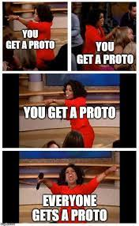

> Javascript objects scopes and  closures



## About
JavaScript is a powerful language with many features, and some of its most important concepts include objects, closures, and scopes. Objects are one of the primary building blocks of JavaScript, and they allow you to store data and functions together in a single entity. Closures are another fundamental concept that allows functions to "remember" their surrounding state, even after they have been called and returned. Finally, scopes define the context in which variables and functions are accessible within your code, and understanding them is critical to writing efficient and effective JavaScript code. Together, these concepts form the backbone of the language and are essential for any developer looking to master JavaScript. Let's have a look at all of these confusing javascript principles in detail, and get lost in the callback hell ... prototype chain.

## Resources
__Read or watch__
1. [Javascript objects basics](https://developer.mozilla.org/en-US/docs/Learn/JavaScript/Objects/Basics)
2. [Object oriented Javascript](https://developer.mozilla.org/en-US/docs/Learn/JavaScript/Objects/Classes_in_JavaScript)
3. [Class - ES6](https://developer.mozilla.org/en-US/docs/Web/JavaScript/Reference/Classes)
4. [super -ES6](https://developer.mozilla.org/en-US/docs/Web/JavaScript/Reference/Operators/super)
5. [extends - ES6](https://developer.mozilla.org/en-US/docs/Web/JavaScript/Reference/Classes/extends)
6. [Object prototypes](https://developer.mozilla.org/en-US/docs/Learn/JavaScript/Objects/Object_prototypes)
7. [Inheritance in JavaScript](https://developer.mozilla.org/en-US/docs/Learn/JavaScript/Objects/Classes_in_JavaScript)
8. [closures](https://developer.mozilla.org/en-US/docs/Web/JavaScript/Closures)
9. [this/self](https://alistapart.com/article/getoutbindingsituations/)
10. [Modern JS](https://github.com/mbeaudru/modern-js-cheatsheet)

## Learning objectives
At the end of this project, you are expected to be able to [explain to anyone](https://fs.blog/feynman-learning-technique/) the following  __Without the help of Google__

* [X] How to create an object in JavaScript
* [X] What ```this``` means
* [X] What undefined means
* [X] Why the variable type and scope is important
* [X] What is a closure
* [X] What is a prototype
* [X] How to inherit an object from another

## Quiz
[Quizes](./quiz.md)